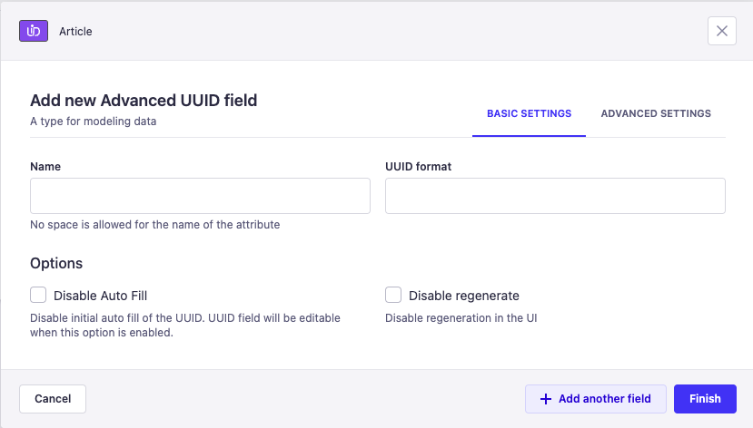

<p align="center">
     
</p>

<h1 align="center">
  Strapi Advanced UUID
</h1>

<p align="center">Custom Field plugin for Strapi to generate UUID based on your regular expressions</p>

<p align="center">
  <a href="https://www.npmjs.com/package/strapi-advanced-uuid">
    
    
  </a>
</p>

The Strapi Advanced UUID Plugin is a custom plugin for Strapi that automatically generates a unique UUID for your content. It also allows you to generate UUID based on your regular expressions.

## ⚠️ Compatibility with Strapi versions

Starting from version 2.0.0, the Strapi Advanced UUID plugin is compatible with Strapi 5 and can't be used in Strapi 4.4+.

| Plugin version | Strapi version |
| -------------- | -------------- |
| 2.x.x          | ≥ 5.0.0        |
| 1.x.x          | ≥ 4.4          |

## ⚙️ Installation

To install the Strapi Advanced UUID Plugin, simply run one of the following command:

```
npm install strapi-advanced-uuid
```

```
yarn add strapi-advanced-uuid
```

## ⚡️ Usage

### How to Setup Advanced UUID Field

After installation you will find the `Advanced UUID` at the custom fields section of the content-type builder.


Now you can define the field attributes. `Advanced UUID` field allows you to define the custom regular expression (`UUID format`) for your field. Default UUID format will be [`UUID V4`](https://www.npmjs.com/package/uuid#uuidv4options-buffer-offset).



### How to Use Custom Regular Expression


Now You can create new records via the Admin panel, API or GraphQL, and the plugin will automatically generate a UUID for each new record created.


## 👍 Contribute

If you want to say **Thank You** and/or support the active development of `Strapi Advanced UUID`:

1. Add a [GitHub Star](https://github.com/Dulajdeshan/strapi-advanced-uuid/stargazers) to the project.
2. Support the project by donating a [cup of coffee](https://buymeacoff.ee/dulajdeshan).

## 🧾 License

This plugin is licensed under the MIT License. See the [LICENSE](./LICENSE.md) file for more information.
