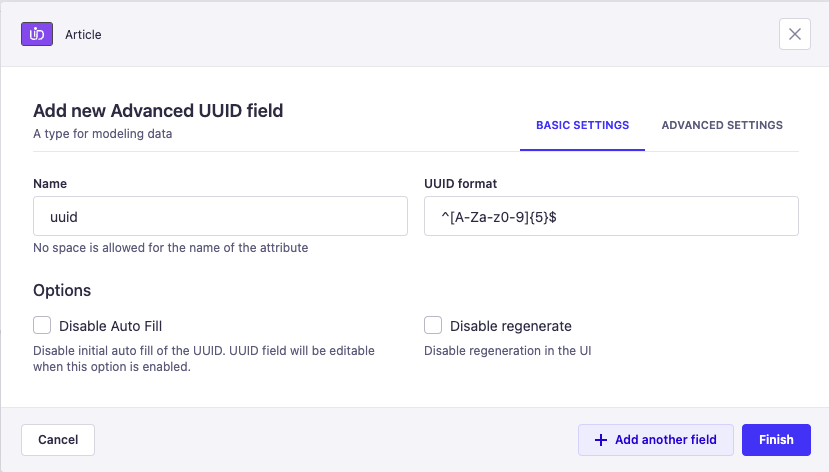

# Strapi Advanced UUID Plugin

The Strapi Advanced UUID Plugin is a custom plugin for Strapi that automatically generates a unique UUID for your content. It also allows you to generate UUID based on your regular expressions.

## Installation

To install the Strapi Advanced UUID Plugin, simply run one of the following command:

```
npm install strapi-advanced-uuid
```
```
yarn add strapi-advanced-uuid
```

## Usage

### How to Setup Advanced UUID Field

After installation you will find the `Advanced UUID` at the custom fields section of the content-type builder.


Now you can define the field attributes. `Advanced UUID` field allows you to define the custom regular expression (`UUID format`) for your field. Default UUID format will be [`UUID V4`](https://www.npmjs.com/package/uuid#uuidv4options-buffer-offset).


### How to Use Custom Regular Expression



Now You can create new records via the Admin panel, API or GraphQL, and the plugin will automatically generate a UUID for each new record created.


## License
This plugin is licensed under the MIT License. See the LICENSE file for more information.
